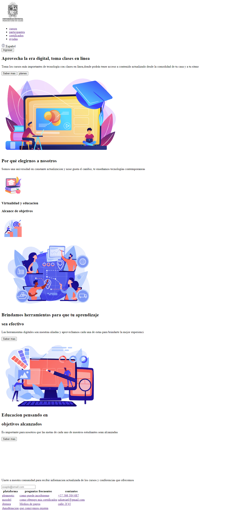
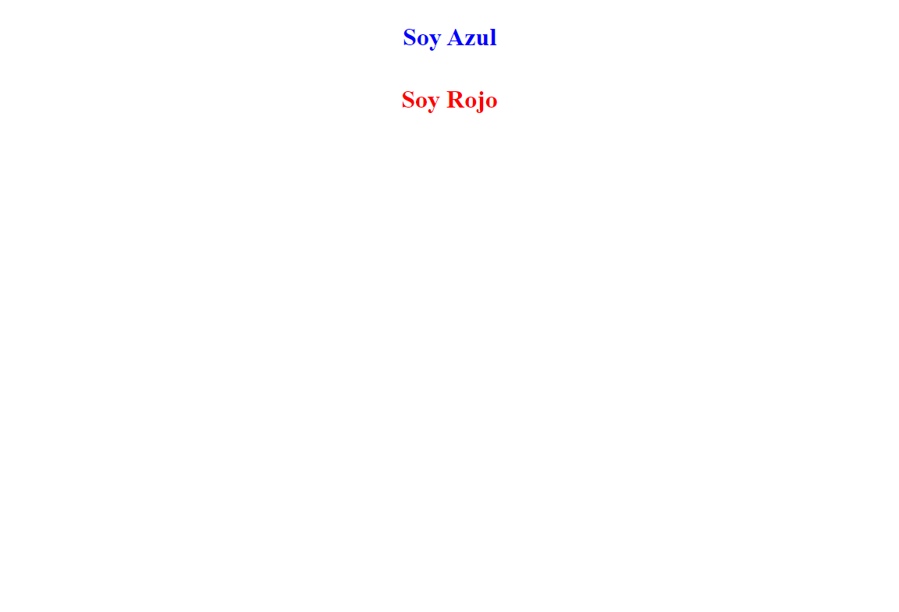
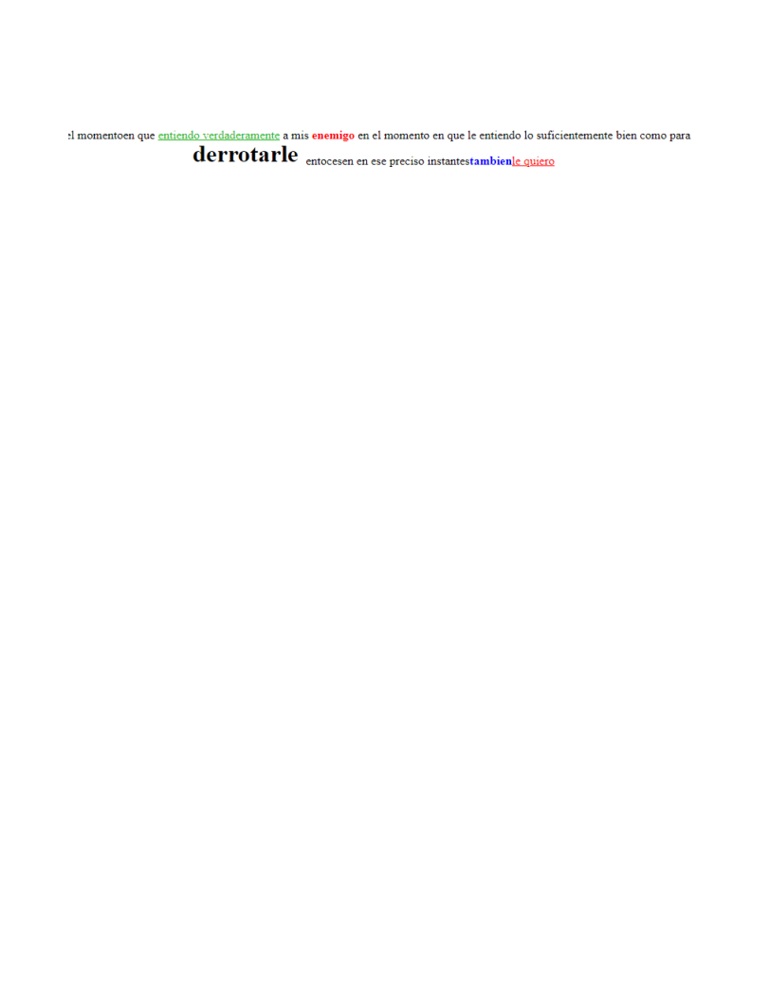

<h1>TALLER 9 - Kevin Santiago Cutiiva Bbocanegra</h1>

<h2>IMFORMACION</h2>

    CURSO: full stark basico - grupo 1

profesor: Creistian Patiño

<h2>link de la pagina web</h2>

<h2>punto 1 link figma</h2>
<a hret="https://www.figma.com/file/mxEZ2KQvQQbhvosfIrefBi/kevin-santiago-cuitiva-bocanegra?type=design&node-id=10%3A2&mode=design&t=JOpfgUHqTQMSI6IL-1">Link de Figma</a>

<h2>punto 2: diseño en html</h2>

</img>

<h2>punto 3: diseño de css</h2>

</img>

<h2>punto 4: titulo</h2>

</img>

<h2>punto 5: parrafo</h2>

</img>

<h2>punto 6: link</h2>

<h2>punto 7 y 8: navegacion</h2>

<h2>punto 9: tablas</h2>